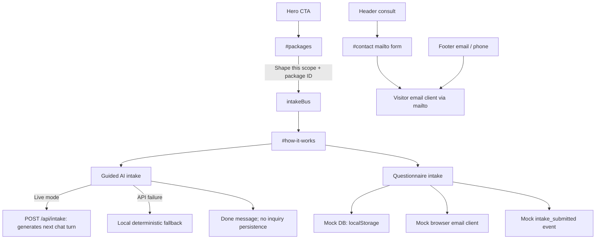

# Conversion-system map

## Current journey map

## Flow inventory

| Flow | Entry and destination | State / fields | Submission and result | Failure / verification / analytics | Risk |
|---|---|---|---|---|---|
| Header consult | `Header` “Book a Consult”/“Let’s Talk” → `#contact` | None | JS scroll only | No event; missing target silently does nothing | Medium |
| Hero CTA | `HeroSection` final beat → `#packages` | None | JS smooth scroll | No event | Medium |
| Package selection | `PackagesSection` “Shape this scope” → `intakeBus` → `#how-it-works` | Package ID: `signature_landing`, `business_platform`, or `ai_integrated_platform` | In-memory event bus; guided intake receives context if mounted/listening | Not persisted, URL-addressable, or tracked; refresh loses context | High |
| Guided live AI | `AIChatDemo`; live selected after successful API turn | Conversation entries, input, package context; server catalog knowledge | `POST /api/intake` calls Anthropic to generate a response; it does **not** save an inquiry | Preview API 404 triggers fallback. UI has retry copy. No analytics. API availability is host/config dependent. | Critical |
| Guided fallback | Automatic after live failure; deterministic engine in `guidedIntake.ts` | Industry; situation; current systems; desired AI systems; extras; timeline; budget; contact entry | Local state reaches “done” summary/message; no DB, email, or server call | Visitor may reasonably infer sending occurred from completion language. No verified submission or event. | Critical |
| Questionnaire | Intake tab in `HowItWorksSection` | Contact: name/email/phone. Business: name/industry/current URL. Goals. Budget/timeline. Theme and optional transcript/package context in data model. | `submitIntake` invokes DB client, two email methods, then `intake_submitted`; shows Thank You state | Current DB real implementation is commented and mock stores in `localStorage`; email client is mock; analytics is mock. Client success is not external delivery. | Critical |
| Final contact form | `ContactSection` / `#contact` | Inquiry type, name, email, company, phone, message | Sets `window.location.href` to encoded `mailto:` | Depends entirely on configured mail client and user sending. No in-page delivery confirmation, server verification, spam protection, consent, or event. | Critical |
| Footer direct contact | Footer email and phone | None | `mailto:` / `tel:` | External-client dependent; no analytics | Medium |

## Current choices and duplicated qualification data

- Industry options exist independently in `ShowcaseTunnelSection`, `guidedIntake`, `IntakeForm`, static `studio.js` scenes, and Contact inquiry types. Labels and coverage differ.
- Package options derive from `quoteConfig.tiers`, while guided intake repeats `TIER_NAMES` for package context.
- Service/system choices are embedded in `guidedIntake` (`INDUSTRY_SYSTEMS`, `AI_SYSTEMS`, `EXTRA_OPTIONS`), the services-orbit `chapters`, quote catalog items, goals, and inquiry types. They are not one taxonomy.
- Theme is presentation state (`velari-theme`) and required submission metadata (`theme TEXT NOT NULL` in `src/db/schema.sql`), coupling visual UI to the data contract.
- Guided intake and questionnaire overlap in industry, timeline, budget, and contact collection but do not share a canonical schema or completion contract.

## Completion semantics

| Mechanism | Can visitor believe completion occurred? | Externally verified? | Current durable destination |
|---|---|---|---|
| Guided live/fallback | Yes, especially at deterministic “done” state | No | None |
| Questionnaire | Yes, explicit “Thank You!” state | No external verification | Browser `localStorage` only in current client |
| Contact mailto | Possibly; browser opens composed message | Only if visitor sends through mail client | Visitor’s email system |
| Footer email/phone | Visitor understands external action | Outside site | Email/phone provider |

## Security, privacy, and abuse baseline

- No observed CAPTCHA, honeypot, rate-limit UI, consent checkbox, privacy link, retention notice, or submission-purpose disclosure on current forms.
- `server/intake/handler.ts` caps conversation length and content size, but no persistent lead submission endpoint exists in the observed flow.
- The package copy claims “Lead capture with bot protection,” which describes an offer, not the current Velari intake implementation.
- `src/db/schema.sql` allows public inserts and makes theme non-null; the active browser client does not currently use the commented Supabase integration.
- No real submission was made during Phase 0.

## Preservation requirements for later phases

1. Do not remove any existing path until a canonical `/start` workflow has server-confirmed storage, delivery, error recovery, privacy/consent treatment, spam controls, and analytics verification.
2. Preserve package context through a durable, testable mechanism before retiring `intakeBus`.
3. Define one canonical intake schema and map every legacy field and option before consolidation.
4. Distinguish “chat completed,” “qualification completed,” “submission attempted,” and “submission confirmed” in UI and analytics.
5. Keep direct email/phone as explicit fallback contact methods, not as an invisible substitute for form submission.
6. Decouple presentation theme from required business data or provide a stable backward-compatible default during schema migration.
